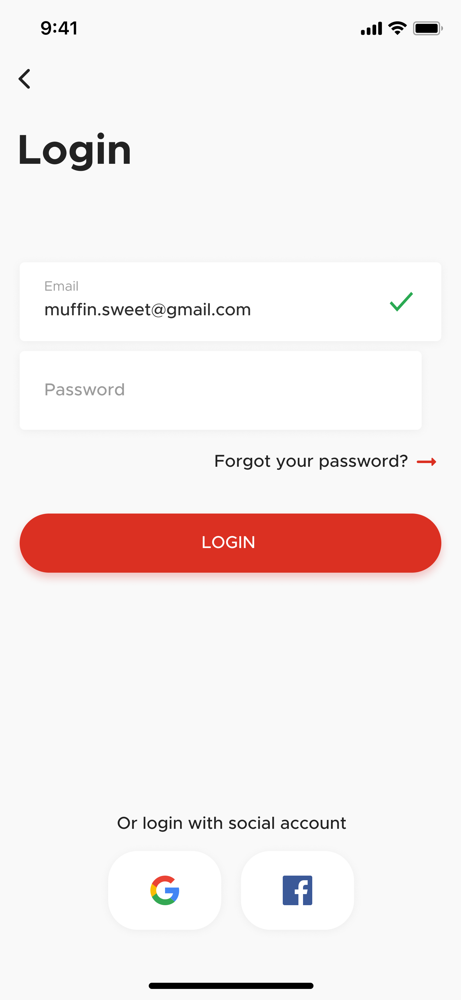
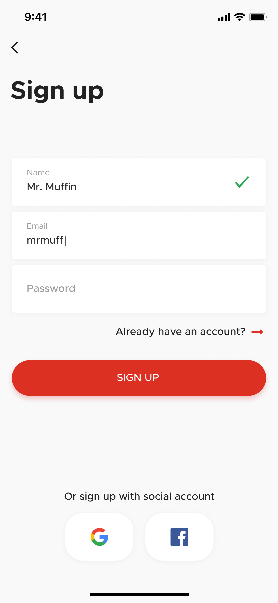
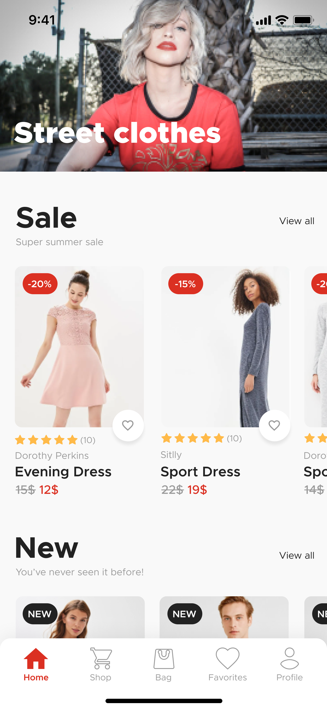

# Introduction:
## :heavy_check_mark: :iphone: Mobile

<h1 align="center">
    
     
    <br>
    
    
</h1>

<a id="how-to"></a>

## :fire: How to use

- ### **Requeriments**

  - It is **necessary** to have the **[Node.js](https://nodejs.org/en/)** instaled in the PC.
  - Also, it is **needed** to have a package manager: **[NPM](https://www.npmjs.com/)** or **[Yarn](https://yarnpkg.com/)**.

1. Make a clone :

```sh
  $ git clone https://github.com/TrickSantos/ecommerce-UI-Clone.git
```

### Execute the aplication:

```sh
  # Install the dependencies
  $ npm install
  # Or
  $ yarn

  # Start the aplication
  $ npx start
  # Or
  $ yarn start
```
